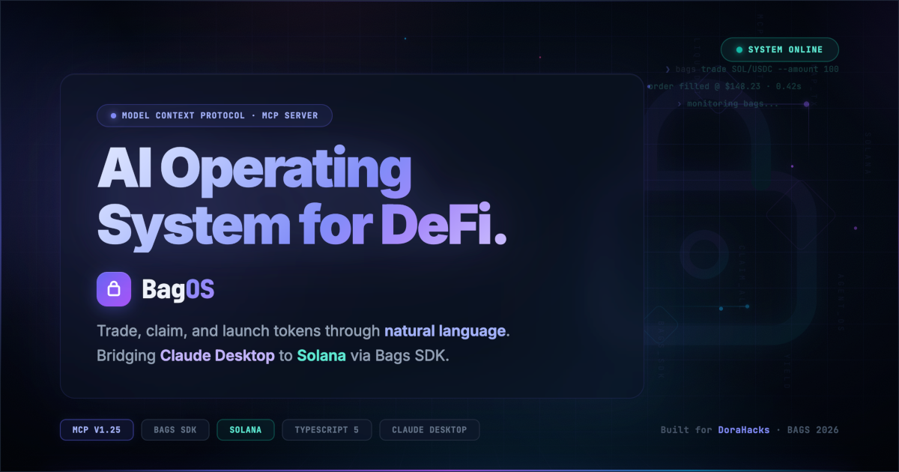
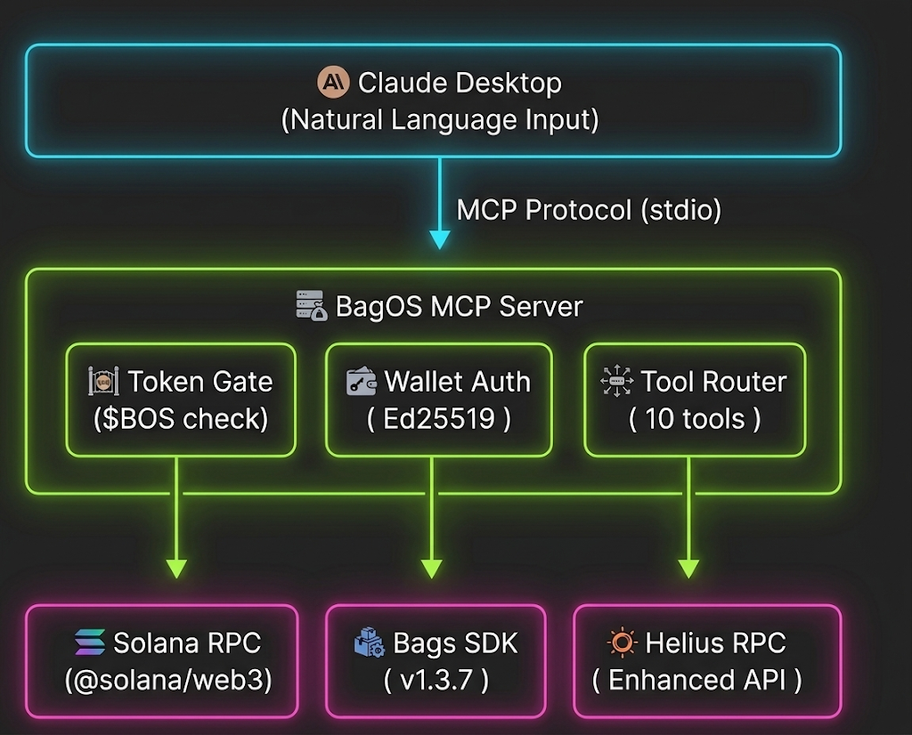

<div align="center">
  <a href="https://github.com/edycutjong/bagos">
    
  </a>
  <h1>🖥️ BagOS</h1>
  <p><em>The AI Operating System for Creator Finance — trade, claim, and launch tokens through natural language.</em></p>

  
  
  
  

  <br/>

  
  
  
  <a href="https://github.com/edycutjong/bagos/pkgs/npm/bagos-mcp-server"></a>

  <br/>

  <a href="https://youtu.be/tJC7rYnksdY"></a>
  <a href="https://dorahacks.io/buidl/43312"></a>
</div>

---

## 🎯 Problem

Bags.fm creators manage their token economy across **3+ different dashboards** — the Bags.fm web app for launches, DEX aggregators for trades, and claim portals for fee collection. This tab-switching workflow is slow, error-prone, and disconnected from modern AI-native workflows.

## 💡 Solution

**BagOS** is the first **Model Context Protocol (MCP) server** for Solana DeFi. It registers 10 native tools directly into Claude Desktop, letting creators manage their entire Bags token economy through natural language.

**No dashboards. No tab-switching. Just type what you want.**

- ⚡ **Instant Authentication** — V2 wallet auth with Ed25519 signature verification
- 🔒 **$BOS Token Gate** — Write operations (trades, claims, launches) require holding ≥10,000 $BOS
- 🚀 **Full Lifecycle** — Launch tokens, execute trades, claim fees, view analytics — all from Claude

---

## 📸 See it in Action

<table>
  <tr>
    <td align="center">
      
      <br/><strong>Claude Desktop Integration</strong>
      <br/><sub>10 MCP tools loaded and ready — natural language DeFi</sub>
    </td>
    <td align="center">
      
      <br/><strong>Wallet Authentication</strong>
      <br/><sub>V2 auth with Ed25519 signature + $BOS token gate verification</sub>
    </td>
  </tr>
  <tr>
    <td align="center">
      
      <br/><strong>Trade Quote</strong>
      <br/><sub>Get real-time swap quotes with slippage protection</sub>
    </td>
    <td align="center">
      
      <br/><strong>Execute Trade</strong>
      <br/><sub>Token swaps executed directly through Claude</sub>
    </td>
  </tr>
  <tr>
    <td align="center">
      
      <br/><strong>Claim Creator Fees</strong>
      <br/><sub>Discover and claim pending fee positions in one command</sub>
    </td>
    <td align="center">
      
      <br/><strong>Launch Token</strong>
      <br/><sub>Deploy a new creator token with metadata — all from chat</sub>
    </td>
  </tr>
</table>

---

## 🏗️ Architecture



---

## 🛠️ Tech Stack

| Layer | Technology |
|-------|-----------|
| MCP Server | `@modelcontextprotocol/sdk` v1.25+ |
| DeFi SDK | `@bagsfm/bags-sdk` v1.3.7+ |
| Blockchain | `@solana/web3.js` + `tweetnacl` + `bs58` |
| Validation | `zod` v4 |
| Runtime | Node.js 22, TypeScript 5 |
| Testing | Jest, 100% coverage |
| Deployment | Docker / Fly.io |

---

## 🔧 Tools Reference

| Tool | Description | Token-Gated |
|------|-------------|:-----------:|
| `bags_authenticate` | V2 wallet authentication via Ed25519 | No |
| `bags_get_claimable_fees` | Discover claimable fee positions | No |
| `bags_claim_fees` | Claim pending creator fees | ✅ |
| `bags_get_trade_quote` | Get swap quotes with slippage | No |
| `bags_execute_trade` | Execute token swaps on Bags pools | ✅ |
| `bags_launch_token` | Launch a new creator token | ✅ |
| `bags_get_creators` | Top creators leaderboard | No |
| `bags_get_token_analytics` | Token pool & claim stats | No |
| `bags_get_partner_stats` | Partner referral earnings | No |
| `bags_heartbeat` | Health check & system summary | No |

---

## 🚀 Getting Started (For Judges)

### 1. Clone & Install

```bash
git clone https://github.com/edycutjong/bagos.git
cd bagos && npm install
```

### 2. Configure Environment

```bash
cp .env.example .env
# Add your BAGS_API_KEY and HELIUS_RPC_URL
```

### 3. Build & Add to Claude Desktop

First, compile the server from TypeScript to JavaScript:
```bash
npm run build
```

Then edit `~/Library/Application Support/Claude/claude_desktop_config.json`:
```json
{
  "mcpServers": {
    "bagos": {
      "command": "node",
      "args": ["/absolute/path/to/bagos/build/index.js"]
    }
  }
}
```

### 4. Restart Claude Desktop & Start Chatting

> **🎬 Judge Shortcut:** Run `npm run demo` to execute the full golden path flow (auth → quote → trade → claim) without needing Claude Desktop configured.

---

## 📁 Project Structure

```
bagos/
├── build/                # Compiled JavaScript output
├── src/
│   ├── index.ts              # MCP server entry point
│   ├── tools/                # 10 MCP tool implementations
│   │   ├── AuthenticateTool.ts
│   │   ├── ClaimFees.ts
│   │   ├── ExecuteTrade.ts
│   │   ├── GetClaimableFees.ts
│   │   ├── GetCreators.ts
│   │   ├── GetPartnerStats.ts
│   │   ├── GetTokenAnalytics.ts
│   │   ├── GetTradeQuote.ts
│   │   ├── Heartbeat.ts
│   │   ├── LaunchToken.ts
│   │   └── index.ts          # Tool registry
│   ├── lib/                  # Shared utilities
│   │   ├── bags-client.ts    # Bags SDK wrapper
│   │   ├── mcp-utils.ts      # MCP response helpers
│   │   ├── token-gate.ts     # $BOS balance verification
│   │   └── wallet.ts         # Solana keypair management
│   └── types/
│       └── IMcpTool.ts       # Tool interface definition
├── scripts/
│   ├── golden-path.ts        # E2E demo script (auth → trade → claim)
│   └── setup.sh              # Environment bootstrap
├── .env.example              # Required environment variables
├── Dockerfile                # Container deployment
├── fly.toml                  # Fly.io deployment config
└── package.json
```

---

## 💰 $BOS Token

$BOS is the access key for BagOS write operations. Hold ≥10,000 $BOS to unlock trades, claims, and token launches.

- **Contract Address**: `BagOS11111111111111111111111111111111111111`
- **Trade on Bags.fm**: [bags.fm/BOS](https://bags.fm/)

---

## 🏆 Sponsor Tracks Targeted

* **Bags SDK** — All 10 MCP tools use the `@bagsfm/bags-sdk` (v1.3.7) for authentication, trading, fee claiming, and token launches. Core integration: [`src/tools/`](./src/tools/)
* **Token Gating** — $BOS token gate implementation verifying on-chain balance before write operations. See: [`src/lib/token-gate.ts`](./src/lib/token-gate.ts)
* **Claude Skills Track** — MCP server architecture enabling Claude Desktop as the primary DeFi interface. Entry point: [`src/index.ts`](./src/index.ts)

---

## 📄 License

MIT © 2026 [Edy Cu](https://github.com/edycutjong)

## Built for [The Bags Hackathon](https://dorahacks.io/hackathon/the-bags-hackathon)

**🚀 BUIDL Link:** [https://dorahacks.io/buidl/43312](https://dorahacks.io/buidl/43312)

Track: Claude Skills | Token: $BOS | By: [@edycutjong](https://x.com/edycutjong)
