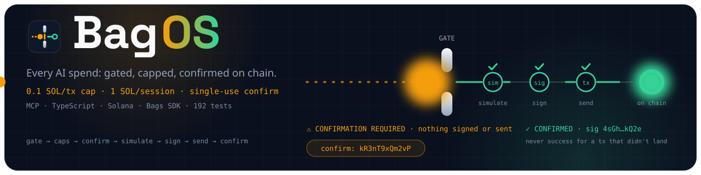

<div align="center">
  
  <h1>BagOS 🚦</h1>
  <p><em>Every AI-initiated Solana spend: gated, capped, confirmed on chain.</em></p>
  

  <p>
    The first call to a write tool <strong>signs nothing</strong> — it answers with a preview and a
    single-use token. Hard cap <strong>0.1 SOL/tx</strong>, 337 tests at 100% coverage, and a live-run
    receipt you can reproduce with <code>npm run demo</code>.
  </p>

  <br/>

  [](https://bagos.edycu.dev)
  [](https://bagos.edycu.dev/deck/)
  [](DEMO.md)
  [](.github/SECURITY.md)
  [](CHANGELOG.md)

  <br/>

  <!-- Install surfaces: every registry that actually serves this server. Each was
       verified live before being listed — a badge for a listing that does not
       resolve is a claim a judge can disprove in one click. -->
  [](https://registry.modelcontextprotocol.io/?q=bagos)
  [](https://smithery.ai/server/edy-cu/bagos)
  [](https://www.npmjs.com/package/bagos-mcp-server)
  [](https://github.com/edycutjong/BagOS/pkgs/npm/bagos-mcp-server)

  <br/>

  
  
  
  
  [](LICENSE)
  [](https://github.com/edycutjong/BagOS/actions/workflows/ci.yml)
  [](https://github.com/edycutjong/BagOS/actions/workflows/publish.yml)
  [](https://github.com/edycutjong/BagOS/actions/workflows/codeql.yml)
  [](https://github.com/edycutjong/BagOS/releases/latest)

</div>

---

> **v2.0.0 corrects a serious defect.** In 1.x the write tools built
> transactions, discarded them, and reported success — nothing was ever signed
> or submitted. If you used 1.x and believed a trade or claim executed, it did
> not. See [CHANGELOG.md](CHANGELOG.md).
>
> **2.0.0 is live on npm** and is what `npx bagos-mcp-server` installs. It ships with
> [npm provenance](https://registry.npmjs.org/-/npm/v1/attestations/bagos-mcp-server@2.0.0) —
> the tarball is cryptographically attested to this repository and the commit that built it.
> If you are still on 1.x, upgrade.

---

## 💡 The Problem & Solution

### The Problem

An MCP server that can move money gives an AI assistant a signing key. The assistant
decides, and the transaction is already on chain by the time a human reads about it.
Nothing in the protocol makes the model pause, and nothing bounds what a single
misunderstood instruction can spend.

### The Solution

BagOS lets an AI assistant read Bags/Solana token data and — with explicit
confirmation — execute swaps and claim creator fees from your wallet. Writes are off
unless you configure them, they are mainnet-only, and the first call to a write tool
signs nothing: it returns a preview and a single-use token that only authorizes the
exact arguments it was issued for.

---

## 🏗️ Architecture & Tech Stack

Every write goes through this:

```
token gate → spend caps → confirmation → simulate → sign → send → confirm
```

| Tool | Type | What it does |
|---|---|---|
| `bags_heartbeat` | read | Server status and wallet reachability |
| `bags_get_token_analytics` | read | Lifetime fee data for a token mint |
| `bags_get_creators` | read | Top token creators by lifetime fees |
| `bags_get_trade_quote` | read | Price quote for a swap. Does not trade. |
| `bags_get_claimable_fees` | read | Fees currently claimable by your wallet |
| `bags_get_partner_stats` | read | Partner config claim statistics |
| `bags_get_token_claim_stats` | read | Per-creator claim totals — the royalty roster with amounts claimed |
| `bags_get_token_claim_events` | read | The claim audit trail for a token, paginated |
| `bags_get_token_creators` | read | Who shares a token's fees, and in what proportion |
| `bags_resolve_launch_wallet` | read | Social handle (twitter/tiktok/kick/github) → fee-share wallet |
| `bags_authenticate` | read | Verify wallet ownership via Ed25519 signature |
| `bags_prepare_token_metadata` | gated | Creates token info + metadata. **Does not launch a token.** |
| `bags_execute_trade` | **write** | Swap tokens. Signs and submits. |
| `bags_claim_fees` | **write** | Claim creator/LP fees. Signs and submits. |

`bags_prepare_token_metadata` reserves a mint and uploads metadata. Completing a
launch also requires a Meteora fee-share config, whose fee-claimer split has to
be your decision — so this server does not implement that step rather than
guessing at it. Finish the launch at [bags.fm](https://bags.fm).

---

## 🔐 Write Tools & Spend Controls

Writes are off unless you configure them, and they are mainnet-only.

**Bags has no devnet deployment.** Its API endpoint and its Meteora/fee-share
program IDs are all mainnet. This server nonetheless defaults to **devnet**, so
an unconfigured install cannot spend real money. Calling a write tool on devnet
returns an explanation, not a cryptic program error.

The first call to a write tool **signs nothing**. It returns a preview and a
single-use token:

```
⚠️  CONFIRMATION REQUIRED — nothing has been signed or sent.

Action:  Swap 0.05 of So1111…1112
         for       EkJuyY…dBAGS
         expect    4823917722 (min 4679199990)
         slippage  3%
         network   🔴 MAINNET — real funds

Spend:   0.05 SOL
Caps:    0.1 SOL/tx · 0/1 SOL used this session

To execute, call bags_execute_trade again with the identical arguments plus:
  confirm: "kR3nT9xQm2vP"
```

The token is a fingerprint of the tool name plus the exact arguments, so one
issued for a 0.01 SOL swap cannot authorize a 10 SOL one. It expires in five
minutes and is consumed on every outcome, so it cannot be replayed.

On success you get a real signature and explorer link — never a success message
for a transaction that did not land.

Set `BAGS_ALLOW_UNCONFIRMED=true` to skip the preview. Spend caps still apply.

**The caps only bind on SOL.** A swap whose input is some other token cannot be
valued in SOL, so no cap can limit it. Those swaps are refused by default; set
`BAGS_ALLOW_UNCAPPED_TOKEN_SWAPS=true` to permit them, and the preview will say
plainly that the trade is uncapped.

---

## 📊 Engineering Rigor

337 tests. The bypass tests around the spend caps and the confirmation step are
load-bearing; treat a change there as a security change. They are mutation-
checked: removing the cap guard, the confirmation check, the decimals lookup,
or the spend recorder each makes the suite fail.

| Layer | Status | Details |
|---|---|---|
| **Real default path** | ✅ | No kill-switch flag in any documented command. `USE_MOCK_DATA` defaults **off**; when on, it affects only the `bags_get_claimable_fees` tool, stamping `⚠️ [MOCK DATA ENABLED]` on that tool's own response. The other 13 tools ignore it. Live-run receipts in [DEMO.md](DEMO.md) |
| Code quality | ✅ | ESLint + `tsc --noEmit`, both clean |
| Unit testing | ✅ | Jest, 337 tests / 17 suites, **100%** statements · branches · functions · lines, enforced |
| High-signal tests | ✅ | Mutation-checked cap/confirmation bypass tests · a leak-channel regression test (the API key used to be echoed into tool output) · network-mismatch refusal |
| Security | ✅ | CodeQL SAST · Dependabot SCA · gitleaks over full history (`fetch-depth: 0`) · secret scanning + push protection on · `npm audit` in CI as a **ratchet** — see below |
| Dependency debt | ⚠️ | **6 advisories, 0 critical** — down from 90. Everything patchable was cleared with version-scoped `overrides` (see [`package.json`](package.json)). The 6 that remain are **one** root cause, `bigint-buffer` [GHSA-3gc7-fjrx-p6mg](https://github.com/advisories/GHSA-3gc7-fjrx-p6mg), counted once at each level of the chain it travels up to `@bagsfm/bags-sdk`. No patched `bigint-buffer` exists — 1.1.5 is the installed version, the latest version, and vulnerable. CI blocks any critical and any increase over [`.audit-baseline.json`](.audit-baseline.json). **Note:** npm honours `overrides` only in a root project, so these protect this repo and CI, not consumers of the published package. |
| CI | ✅ | 4 stages (Quality → Security ∥ Test → Build) with `cancel-in-progress` concurrency; Node 22 + 24 matrix; packaged-artifact and entrypoint checks |
| CD | ✅ | Release → tarball audit → `npm publish --provenance` → deprecate the superseded version. A second workflow submits `server.json` to the MCP registry via OIDC. Both gated on the full CI suite. **1.0.0 is not yet deprecated** — 2.0.0 predates that step, so it needs one manual run of `deprecate.yml`. |
| On-chain proof | ⚠️ | `npm run proof:devnet` exists and lands a real devnet transaction, but the public faucet was dry on 2026-08-15 — no signature captured yet. See [DEMO.md](DEMO.md) |
| Community standards | ✅ | Code of Conduct · Contributing · Security policy · issue + PR templates |

E2E browser tests and Lighthouse budgets are deliberately absent: this is a stdio/HTTP MCP
server with no web UI, so both would measure nothing. The equivalent end-to-end coverage is
`npm run demo`, which drives all read tools over real MCP JSON-RPC against the live API.

---

## 🚀 Getting Started

### Prerequisites

You need a Bags API key from [dev.bags.fm](https://dev.bags.fm). That alone
enables the read-only tools. For trading and fee claims you also need a Solana
keypair file and the gating token — see
[Write Tools & Spend Controls](#-write-tools--spend-controls).

### Installation

```bash
npx bagos-mcp-server
```

**Claude Desktop** — `~/Library/Application Support/Claude/claude_desktop_config.json`
(macOS) or `%APPDATA%\Claude\claude_desktop_config.json` (Windows):

```json
{
  "mcpServers": {
    "bagos": {
      "command": "npx",
      "args": ["-y", "bagos-mcp-server"],
      "env": {
        "BAGS_API_KEY": "your-key-here"
      }
    }
  }
}
```

**Claude Code**:

```bash
claude mcp add bagos --env BAGS_API_KEY=your-key-here -- npx -y bagos-mcp-server
```

Restart the client, then ask it: *"check the bagos heartbeat"*. The server
prints a configuration report to stderr on startup; if something is missing it
tells you which variable and why.

To enable writes:

```json
{
  "mcpServers": {
    "bagos": {
      "command": "npx",
      "args": ["-y", "bagos-mcp-server"],
      "env": {
        "BAGS_API_KEY": "your-key-here",
        "BAGS_NETWORK": "mainnet",
        "BAGS_KEYPAIR_PATH": "~/.config/bags/keypair.json",
        "BOS_TOKEN_MINT": "EkJuyYyD3to61CHVPJn6wHb7xANxvqApnVJ4o2SdBAGS",
        "BAGS_MAX_SOL_PER_TX": "0.1",
        "BAGS_MAX_SOL_PER_SESSION": "1.0"
      }
    }
  }
}
```

### Configuration

| Variable | Required | Default | Notes |
|---|---|---|---|
| `BAGS_API_KEY` | yes | — | From [dev.bags.fm](https://dev.bags.fm) |
| `BAGS_NETWORK` | no | `devnet` | `devnet` or `mainnet`. Writes need mainnet. |
| `SOLANA_RPC_URL` | no | public cluster RPC | Must agree with `BAGS_NETWORK` or the server refuses to start |
| `BAGS_KEYPAIR_PATH` | writes only | `~/.config/bags/keypair.json` | JSON byte-array keypair file |
| `BOS_TOKEN_MINT` | writes only | — | Gating token mint |
| `BOS_REQUIRED_BALANCE` | no | `10000` | Minimum gating-token balance |
| `BAGS_MAX_SOL_PER_TX` | no | `0.1` | Per-transaction spend cap |
| `BAGS_MAX_SOL_PER_SESSION` | no | `1.0` | Per-process spend cap |
| `BAGS_ALLOW_UNCONFIRMED` | no | `false` | Skip the confirmation step |
| `BAGS_ALLOW_UNCAPPED_TOKEN_SWAPS` | no | `false` | Permit swaps whose input is not SOL. The caps are SOL-denominated and **cannot limit these**. |

---

## 🧪 Testing & CI

```bash
npm ci
npm run ci            # lint + typecheck + tests with coverage
npm run dev           # stdio server with watch
npm run inspector     # MCP Inspector against the built server
npm run proof:devnet  # land a real devnet transaction through the write path
```

`proof:devnet` generates a throwaway keypair, funds it from the devnet faucet,
and pushes a transfer through the same simulate/sign/send/confirm path the write
tools use — then re-fetches the signature from the chain instead of trusting the
function's return value. Use it to verify the execution layer end to end.

---

## 📽️ Demo Materials

- **[DEMO.md](DEMO.md)** — receipts from a real run against the live Bags mainnet API:
  7 scenarios, 8 steps, per-step latency, plus the network-mismatch guard and the token
  gate caught refusing a write.
- **[docs/examples.md](docs/examples.md)** — prompts you can type at your assistant and
  what each should do.

---

## 🛡️ Security

Read [SECURITY.md](.github/SECURITY.md) before pointing a funded wallet at this.

Summary: your private key is read from disk, used to sign, and never logged,
never sent anywhere, and never placed in an error message. Tool errors return
a message only — no stack traces — with key-shaped strings redacted. The startup
report strips credentials from the RPC URL. If the RPC endpoint's cluster
disagrees with `BAGS_NETWORK`, the server refuses to start rather than sign
mainnet transactions under a devnet banner.

The same rule now covers the **Bags API key**: `bags_authenticate` writes it to
`~/.config/bags/credentials.json` and echoes only a four-character tail. It used
to print the key in full, which published a live credential into the assistant's
context and every transcript downstream of it. If you ran `bags_authenticate` on
a version before this change, rotate that key at [dev.bags.fm](https://dev.bags.fm).

Report vulnerabilities via
[GitHub security advisories](https://github.com/edycutjong/BagOS/security/advisories/new).

---

## 📄 License

MIT — see [LICENSE](LICENSE).
